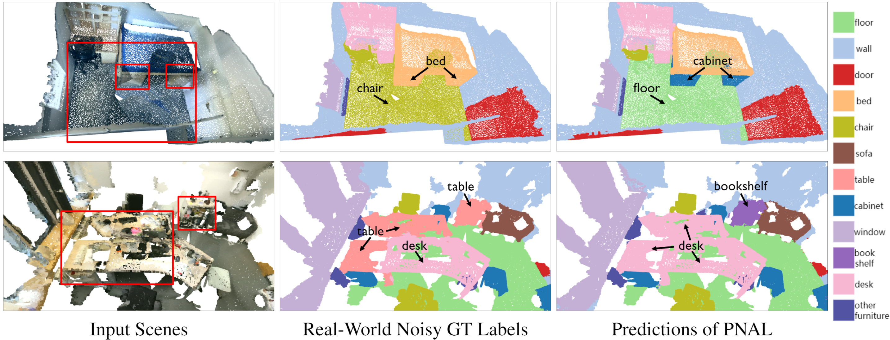
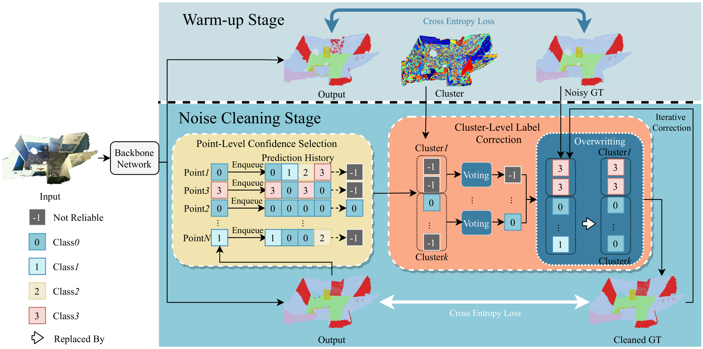

# Learning with Noisy Labels for Robust Point Cloud Segmentation (iccv2021oral)

### [Project Page](https://shuquanye.com/PNAL_website/) | [Paper (ArXiv)]() | [Pre-trained Models]() | [Supplemental Material]()

**This repository is the official pytorch implementation of the proposed *Point Noise-Adaptive Learning (PNAL)* framework our ICCV 2021 oral paper, *Learning with Noisy Labels for Robust Point Cloud Segmentation*.**

[Shuquan Ye](https://shuquanye.com/)1,
[Dongdong Chen](https://www.dongdongchen.bid/)2,
[Songfang Han](http://hansf.me/)3,
[Jing Liao](https://liaojing.github.io/html/)1  
1City University of Hong Kong, 2Microsoft Cloud AI,3 University of California

## :star2: Pipeline

## :rocket: Code

Code and dataset is coming soon...